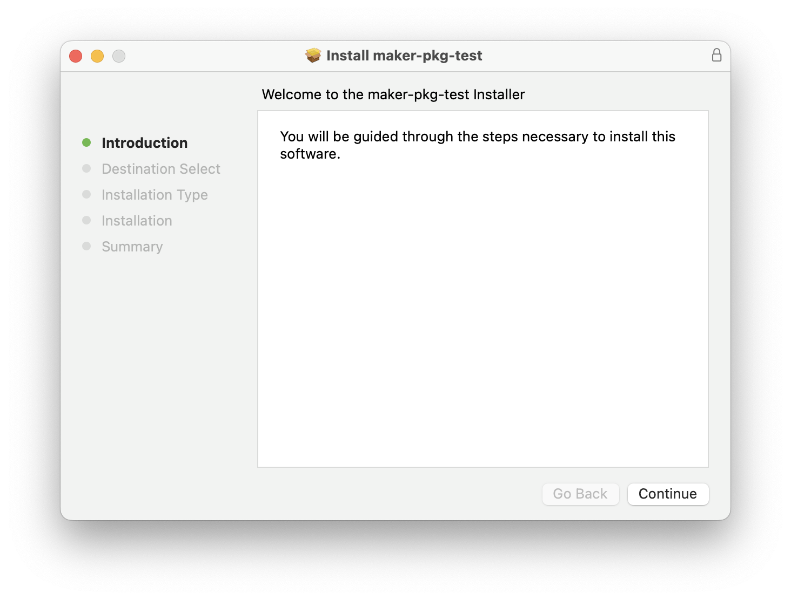

# pkg

The pkg target builds a `.pkg` installer for macOS. These are used to upload your application to the Mac App Store (MAS), or can be used as an alternate distribution method to users outside of the app store.

<figure><figcaption><p>Installation wizard when opening the <code>.pkg</code> installer file</p></figcaption></figure>

This format is often referred to as a **flat package installers** for historical purposes. Prior to Mac OS X Leopard (10.5), installation packages were organized in hierarchical directories. OS X Leopard introduced a new flat package format that is used for modern `.pkg` installers.

The flat installer package format is sparsely documented by Apple. If you want to learn more about its specification, there are a few userland articles available:

* [Flat Package Format - The missing documentation](http://s.sudre.free.fr/Stuff/Ivanhoe/FLAT.html) (Stéphane Sudre)
* [The Flat Package - Examining a newer package format](https://preserve.mactech.com/articles/mactech/Vol.26/26.02/TheFlatPackage/index.html) (MacTech)

## Requirements

You can only build the pkg target on macOS machines while targeting the `darwin` or `mas` platforms.

## Installation

```bash
npm install --save-dev @electron-forge/maker-pkg
```

## Usage

To use `@electron-forge/maker-pkg`, add it to the `makers` array in your [Forge configuration](../configuration.md):


```javascript
module.exports = {
  makers: [
    {
      name: '@electron-forge/maker-pkg',
      config: {
        keychain: 'my-secret-ci-keychain'
        // other configuration options
      }
    }
  ]
};
```


All configuration options are optional, and options are documented in the API docs for [`MakerPkgConfig`](https://js.electronforge.io/interfaces/\_electron\_forge\_maker\_pkg.MakerPKGConfig.html).

### Adding installation scripts

With the pkg maker, you can add either a `preinstall` or `postinstall` bash script that runs before and after your app is installed, respectively.

Both `preinstall` and `postinstall` scripts need to:

* have execution permissions
* be extension-less
* be located in the same folder in your filesystem

For example, they can live in a folder in your project called `scripts`.

```
my-app
├─── forge.config.js
└─── scripts
    ├── postinstall
    └── preinstall
```

Then, your Forge configuration would need to point to the `./scripts` folder.

<pre class="language-javascript" data-title="forge.config.js"><code class="lang-javascript"><strong>const path = require('node:path');
</strong>
module.exports = {
  makers: [
    {
      name: '@electron-forge/maker-pkg',
      config: {
<strong>        install: path.join(__dirname, 'scripts)
</strong>      }
    }
  ]
};

</code></pre>

## Debugging

All logs for your flat package installer can be found in macOS installation logs, which are stored in `/var/log/install.log`. They are also accessible within the [Console.app](https://support.apple.com/en-ca/guide/console/welcome/mac) utility.

For advanced debug logging for this maker, add the `DEBUG=electron-osx-sign*` environment variable.
